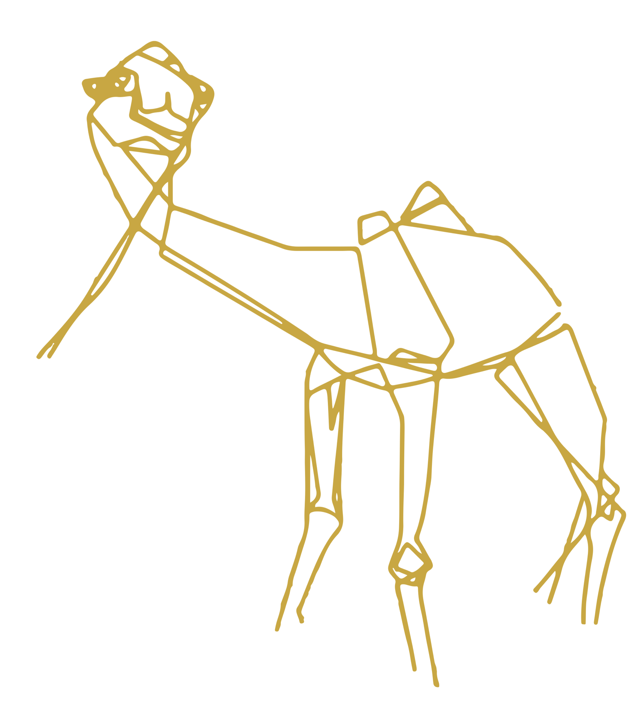

<!-- PROJECT SHIELDS -->

[![Contributors][contributors-shield]][contributors-url]
[![Forks][forks-shield]][forks-url]
[![Stargazers][stars-shield]][stars-url]
[![Issues][issues-shield]][issues-url]

<!-- PROJECT LOGO -->

  

  <h3 align="center">AI Grams PM project</h3>

  

    <a href="https://github.com/AIGrams/ai_grams_pm/doc/ai_grams_pm_doc.html"><strong>Explore the docs »</strong></a>
  

<!-- TABLE OF CONTENTS -->

  
Table of Contents

  <ol>
    <li>
      <a href="#about-the-project">About The Project</a>
    </li>
    <li>
      <a href="#getting-started">Getting Started</a>
      <ul>
        <li><a href="#prerequisites">Prerequisites</a></li>
        <li><a href="#installation">Installation</a></li>
      </ul>
    </li>
    <li><a href="#license">License</a></li>
    <li><a href="#contact">Contact</a></li>
  </ol>

<!-- MARKDOWN LINKS & IMAGES -->
[contributors-shield]: https://img.shields.io/github/contributors/AIGrams/ai_grams_pm.svg?style=for-the-badge
[contributors-url]: https://github.com/AIGrams/ai_grams_pm/graphs/contributors
[forks-shield]: https://img.shields.io/github/forks/AIGrams/ai_grams_pm.svg?style=for-the-badge
[forks-url]: https://github.com/AIGrams/ai_grams_pm/network/members
[stars-shield]: https://img.shields.io/github/stars/AIGrams/ai_grams_pm.svg?style=for-the-badge
[stars-url]: https://github.com/AIGrams/ai_grams_pm/stargazers
[issues-shield]: https://img.shields.io/github/issues/AIGrams/ai_grams_pm.svg?style=for-the-badge
[issues-url]: https://github.com/AIGrams/ai_grams_pm/issues